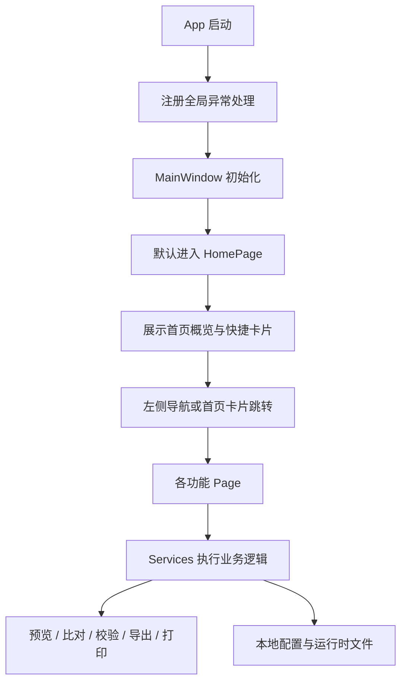

# CCToolbox

面向 Windows 场景的数据处理与办公辅助工具箱，基于 WPF 构建，聚合了首页概览、数据导入、CSV 预览与对比、数据验证、JSON 处理、绘图辅助、票据打印与系统设置等能力。


## 项目概览

- 应用名称：`CCToolbox`
- 技术栈：`.NET 10` + `WPF`
- 目标框架：`net10.0-windows10.0.19041.0`
- 运行平台：`Windows 10 / 11 x64`
- 当前版本：`2.0.0`

项目当前采用 `Page + code-behind + Service` 的结构组织方式，而不是 MVVM。`MainWindow` 负责左侧导航和主内容区切换，`Views` 负责页面交互，`Services` 负责解析、对比、校验、导出、打印和配置持久化等业务逻辑。

## 页面与导航

当前主界面分为左侧导航栏和右侧内容区两部分。

左侧导航栏分组如下：

- 数据工具：`首页概览`、`数据导入临时表`、`CSV 预览工具`、`CSV 对比工具`、`数据验证排查`
- 开发工具：`JSON 处理工具`、`JSON 对比工具`、`Excalidraw 画板`
- 办公工具：`发票打印工具`
- 系统：`系统设置`

首页概览不是单纯欢迎页，而是一个独立的主控入口页，负责：

- 展示产品标题、副标题、作者信息和当前版本
- 以快捷卡片形式汇总主要功能入口
- 提供从首页直接跳转到各核心工具页的能力
- 展示底部系统信息面板，包括版本号、运行环境和当前日期

## 功能清单

### 1. 首页概览

- 默认启动后首先进入首页概览
- 展示欢迎信息、版本徽标和作者信息
- 通过快捷功能卡片直达核心业务页
- 汇总展示系统信息，便于确认当前运行环境

当前首页快捷入口覆盖：

- 数据导入临时表
- CSV 预览工具
- CSV 对比工具
- JSON 处理工具
- JSON 对比工具
- Excalidraw 画板
- 发票打印工具
- 数据验证排查

### 2. 数据导入与 SQL 生成

- 支持导入 `.xlsx`、`.xls`、`.csv`、`.dbf`
- Excel 支持多 Sheet 选择
- CSV 自动识别编码与分隔符
- DBF 支持切换编码并重新加载
- 支持拖拽导入、表格预览与直接编辑
- 支持生成 PostgreSQL、SQL Server、MySQL、Oracle 的建表与插入 SQL
- 支持导出当前预览数据为 `CSV` / `JSON`
- 设置页保存的默认导入参数会实时同步到本页

### 3. CSV 预览工具

- 只读方式浏览 `CSV` / `TXT` / `TSV`
- 自动识别编码与分隔符
- 支持全文搜索、结果跳转与表格定位
- 以共享读取方式打开文件，尽量减少文件占用冲突

### 4. CSV 对比工具

- 支持按行号对比
- 支持按一个或多个公共字段组成复合键进行对比
- 支持识别列新增、列删除、行新增、行删除、单元格修改
- 主键模式下可先检测重复键并阻止错误对比
- 支持筛选、分页、详情查看、复制报告、导出差异结果
- 页面状态可在同一次程序运行期间跨菜单切换保留

### 5. 数据验证排查

- 支持导入目标表结构 DDL
- 支持从 Excel 导入目标结构和源数据
- 支持解析 `INSERT` 语句作为源数据
- 支持字段自动匹配与人工调整映射
- 支持主键字段配置，用于去重统计与结果展示
- 支持字符串长度、数值、日期、布尔、GUID、JSON、非空等规则校验
- 支持进度显示、取消校验与导出 Excel 报告

### 6. JSON 处理工具

- 支持 JSON 美化、压缩、校验
- 左侧为原始 JSON 编辑区，右侧为自定义 GRID 结构视图
- 支持左侧文本搜索和右侧结构搜索
- 支持点击右侧节点反向定位左侧原始 JSON
- 支持导入、导出与 `JSON -> CSV`

### 7. JSON 对比工具

- 支持深度比较两个 JSON 文档
- 可识别新增、删除、值变化、类型变化
- 对对象按键比较，对数组按索引比较
- 支持过滤结果、复制文本报告与导出差异结果

### 8. Excalidraw 画板

- 基于 `WebView2` 嵌入 Excalidraw
- 支持打开场景文件、保存场景、导出 `PNG` / `SVG`
- 通过页面脚本与宿主应用通信，完成场景读取与导出
- 支持刷新和在浏览器中打开

说明：

- 本功能依赖 `Microsoft Edge WebView2 Runtime`
- 如果目标机器未安装 WebView2 Runtime，画板页将无法正常初始化

### 9. 发票打印工具

- 支持导入 `PDF`、`OFD`、`JPG`、`JPEG`、`PNG`、`BMP`、`TIF`、`TIFF`
- 支持文件与目录递归导入
- 自动按路径和文件内容哈希去重
- 支持版式模板、边距、偏移、方向、画质、裁切线等参数配置
- 支持预览全部导入文件、PDF 分页浏览与批量打印
- 保存打印模板与打印历史

### 10. 系统设置与内置小工具

系统设置当前支持保存这些默认项：

- 默认数据库类型
- 默认表名
- 默认批量行数
- 是否默认生成 `DROP TABLE`
- 是否默认启用批量插入
- 是否默认限制字段长度
- 默认导出路径

内置小工具包括：

- 身份信息生成
- Base64 编解码
- UUID / GUID 生成
- MD5 / SHA1 / SHA256 计算
- URL 编解码
- 正则测试
- 纯文本逐行对比
- 运行环境信息查看

## 完整流程框架

### 1. 应用主链路



对应代码入口：

- `App.xaml.cs`：注册 UI 线程、后台线程、Task 的全局异常处理
- `MainWindow.xaml.cs`：承载左侧导航与主 `Frame`
- `Views/HomePage.xaml.cs`：首页快捷卡片与系统信息展示

### 2. 页面结构

```text
主窗口
├─ 左侧导航栏
│  ├─ 数据工具
│  ├─ 开发工具
│  ├─ 办公工具
│  └─ 系统
└─ 右侧内容区
   ├─ 首页概览
   ├─ 数据导入临时表
   ├─ CSV 预览工具
   ├─ CSV 对比工具
   ├─ 数据验证排查
   ├─ JSON 处理工具
   ├─ JSON 对比工具
   ├─ Excalidraw 画板
   ├─ 发票打印工具
   └─ 系统设置
```

### 3. 首页概览流程

```text
程序启动
-> MainWindow 创建
-> Frame 默认加载 HomePage
-> 首页展示版本/作者/环境信息
-> 用户点击快捷卡片
-> 跳转到对应功能页
```

### 4. 关键业务流程

#### 数据导入页流程

```text
选择文件或拖拽导入
-> 按文件类型解析
-> 载入 DataTable
-> 表格预览与编辑
-> 生成 SQL
-> 复制/保存 SQL 或导出 CSV/JSON
```

#### CSV 对比页流程

```text
加载左文件和右文件
-> 选择对比模式
-> 计算表头差异与行级差异
-> 展示摘要、详情、分页结果
-> 导出对比结果或复制报告
```

#### 数据验证页流程

```text
导入目标结构
-> 导入源数据
-> 自动匹配字段
-> 人工确认映射与主键
-> 执行校验
-> 查看问题清单
-> 导出 Excel 报告
```

#### JSON 工具页流程

```text
输入或导入 JSON
-> 美化或压缩
-> 解析为结构节点
-> 左右联动搜索与定位
-> 导出 JSON/CSV
```

#### 发票打印页流程

```text
导入文件或文件夹
-> 去重与读取元信息
-> 选择模板与打印参数
-> 渲染预览页
-> 执行打印
-> 写入模板与历史记录
```

## 目录结构

```text
.
├─ README.md
├─ WpfApp1.slnx
├─ artifacts/
├─ publish/
└─ WpfApp1/
   ├─ App.xaml
   ├─ App.xaml.cs
   ├─ MainWindow.xaml
   ├─ MainWindow.xaml.cs
   ├─ WpfApp1.csproj
   ├─ Behaviors/
   │  └─ ScrollViewerAssist.cs
   ├─ Models/
   ├─ Services/
   ├─ Views/
   │  ├─ HomePage.xaml
   │  ├─ DataImportPage.xaml
   │  ├─ CsvViewerPage.xaml
   │  ├─ CsvComparePage.xaml
   │  ├─ DataValidationPage.xaml
   │  ├─ JsonToolPage.xaml
   │  ├─ JsonDiffPage.xaml
   │  ├─ DrawBoardPage.xaml
   │  ├─ InvoicePrintPage.xaml
   │  └─ SettingsPage.xaml
   └─ Properties/
      ├─ launchSettings.json
      └─ PublishProfiles/
```

## 开发环境

- Windows 10 / 11 x64
- .NET 10 SDK
- Visual Studio 2022 或支持 WPF 的 .NET 开发环境

## 本地运行

### 命令行

```powershell
dotnet run --project .\WpfApp1\WpfApp1.csproj
```

### 可执行文件位置

- Debug：`WpfApp1\bin\Debug\net10.0-windows10.0.19041.0\CCToolbox.exe`
- Release：`WpfApp1\bin\Release\net10.0-windows10.0.19041.0\CCToolbox.exe`

### Visual Studio 启动配置

当前默认保留一个本地调试启动项：

- `CCToolbox-DebugLocal`

## 发布单文件 EXE

项目内置发布配置：`SingleFile-win-x64`

执行命令：

```powershell
dotnet publish .\WpfApp1\WpfApp1.csproj -c Release -p:PublishProfile=SingleFile-win-x64
```

输出路径：

```text
artifacts/publish/win-x64-single/CCToolbox.exe
```

当前发布策略：

- `win-x64`
- `Release`
- `Self-contained`
- `PublishSingleFile=true`
- `IncludeNativeLibrariesForSelfExtract=true`
- `EnableCompressionInSingleFile=true`
- `PublishTrimmed=false`

## 运行时文件

程序运行后，可能会在可执行文件目录下生成这些文件：

- `settings.json`
- `invoice_templates.json`
- `invoice_print_history.json`

这些文件用于保存用户配置、打印模板和打印历史。

Excalidraw 使用的 WebView2 用户数据目录位于当前用户本地应用数据目录，不写入仓库。

## 主要依赖

- `CsvHelper`
- `EPPlus`
- `ExcelDataReader`
- `ExcelDataReader.DataSet`
- `Microsoft.Data.SqlClient`
- `Microsoft.Web.WebView2`
- `Npgsql`

## 已知说明

- 当前主界面采用页面导航式架构，首页概览是默认入口页和统一分发页
- `PgBackupPage` 已处于废弃占位状态，不再作为主流程页面
- `DatabaseImportService.cs` 已迁移为兼容占位，实际导入 SQL 生成功能由 `SqlGeneratorService.cs` 承担

## 最近更新

### 2.0.0

- 同步项目版本为 `2.0.0`
- 将首页概览补充为正式功能模块写入 README
- 更新左侧导航分组与首页快捷入口说明
- 按当前代码结构重写流程框架与目录结构
- 更新运行、发布、依赖与运行时文件说明

## 许可证

MIT
